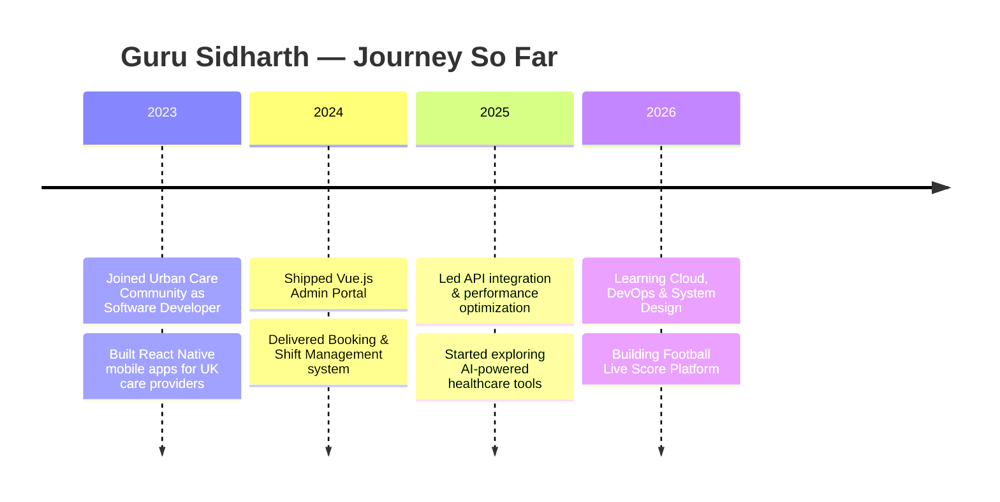

<!-- ============================================================ -->
<!--                        HERO / TYPING SVG                     -->
<!-- ============================================================ -->
<h1 align="center">
  
  Hi, I'm Guru Sidharth
  
</h1>

<h3 align="center">
  💻 Full Stack Developer&nbsp;|&nbsp;📱 React Native Developer&nbsp;|&nbsp;🏗️ Building Scalable Web & Mobile Applications
</h3>

<p align="center">
  
</p>

<p align="center">
  
  
  
</p>

<p align="center">
  <a href="https://www.linkedin.com/in/guru-sidharth/" target="_blank">
    
  </a>
  <a href="mailto:gurusidharthdev@gmail.com">
    
  </a>
  <a href="https://gurusidharth.dev" target="_blank">
    
  </a>
</p>

---

## 🚀 About Me

💻 I'm a **Full Stack Developer** with **3+ years of professional experience** building modern web and mobile applications.

🏥 Currently working as a **Software Developer at Urban Care Community (UCC)**, developing healthcare and social care management systems used across the **United Kingdom**.

```javascript
const guru = {
  role: "Full Stack Developer",
  focus: ["React Native", "React", "Vue.js", "Node.js"],
  currentlyLearning: ["Next.js", "TypeScript", "Docker", "Kubernetes", "AWS", "System Design"],
  funFact: "I ship code and coffee in equal measure ☕",
};
```

### 👨‍💻 What I Do
- 📱 React Native Mobile Development
- 🌐 Full Stack Web Development
- ⚛️ React & Vue.js
- 🟢 Node.js & Express.js
- 🍃 MongoDB & MySQL
- 🔗 REST APIs
- 🎨 Responsive UI/UX Development

### 🎯 Career Goal
Build scalable, enterprise-grade web and mobile applications while continuously learning modern technologies.

---

## 💻 Tech Stack

<p align="center">
  
</p>

<details>
<summary>📊 <b>Detailed Skill Breakdown</b></summary>
<br/>

**Frontend**


**Backend**


**Database & Cloud**


**Tools**


</details>

---

## 💼 Professional Experience

```text
2023 ─────────────────────────────────────────────────────▶ Present
 │
 └── 🏥 Software Developer @ Urban Care Community (UCC)
     📍 Chennai, India | March 2023 – Present
     Building a healthcare platform serving care providers across the UK
```

**Key Contributions**
- 📱 React Native Mobile Applications
- 🌐 Vue.js Admin Portal
- 📅 Booking & Shift Management
- 🔔 Push Notifications
- 🔐 Authentication & Authorization
- 📊 Dashboard Development
- 💳 Payment Workflow
- ⚡ API Integration & Performance Optimization

---

## 🚀 Featured Projects

<table>
<tr>
<td width="50%">

### 🏥 Healthcare Management Platform
A complete healthcare & social care management platform supporting care providers across the UK.

`React Native` `Vue.js` `Node.js` `Express.js` `MongoDB`

</td>
<td width="50%">

### 🤖 AI Healthcare Platform
AI-powered healthcare platform integrating secure authentication, patient management, and AI capabilities.

`Next.js` `TypeScript` `Supabase` `Tailwind CSS`

</td>
</tr>
<tr>
<td width="50%">

### ⚽ Football Live Score Platform
A football platform inspired by OneFootball — live scores, match stats, competitions, teams, transfers, news, and videos.

`Next.js` `Node.js` `MongoDB`

</td>
<td width="50%">

### 🌟 Your Next Big Idea
Have a project in mind? Let's build something awesome together.

`Open to Collaboration`

</td>
</tr>
</table>

---

## 🔥 GitHub Stats & Streak

<p align="center">
  
  
</p>

<p align="center">
  
  
</p>

---

## 📈 Contribution Graph

<p align="center">
  
</p>

---

## 📅 Timeline



---

## 🎯 2026 Goals

- 🚀 Master Full Stack Development
- ☁️ Learn Cloud & DevOps
- 📱 Publish React Native Apps
- 🌍 Work for an International Product Company
- 💻 Build Enterprise SaaS Products
- 🌟 Contribute to Open Source

---

## 📚 Certifications

- ☁️ AWS Cloud Computing
- 📖 Continuous Learning in Cloud & DevOps

---

## 💬 Quote

> **"Code is like humor. When you have to explain it, it's bad."** — Cory House

---

## ☕ Support Me

<p align="center">
  <a href="https://www.buymeacoffee.com/gurusidharth" target="_blank">
    
  </a>
  <a href="https://ko-fi.com/gurusidharth" target="_blank">
    
  </a>
</p>

If my work has helped you, consider supporting me or ⭐ starring my repositories!

---

## 📫 Reach Me

- 📧 **Email:** gurusidharthdev@gmail.com
- 💼 **LinkedIn:** [linkedin.com/in/guru-sidharth](https://www.linkedin.com/in/guru-sidharth/)

---

<!-- ============================================================ -->
<!--                        FOOTER                                -->
<!-- ============================================================ -->
<p align="center">
  
</p>

<h3 align="center">⭐ Thanks for visiting my profile!</h3>
<p align="center">If you like my work, consider giving a star to my repositories.</p>
