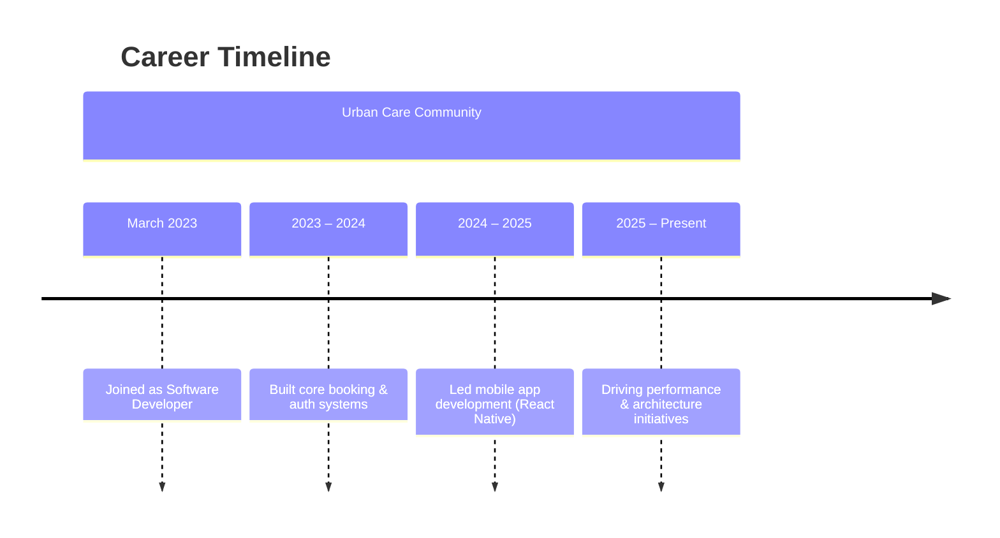

<h1 align="center">Guru Sidharth</h1>

<h3 align="center">Software Engineer&nbsp;|&nbsp;Full Stack Developer&nbsp;|&nbsp;React Native Developer</h3>

  

  
  
  
  

  
  
  
  
  

  

---

## About Me

I am a Software Engineer with **3+ years of experience** designing, building, and shipping production-grade full stack and mobile applications. I currently work as a **Software Developer at Urban Care Community**, where I own features end-to-end — from system design and API architecture to UI implementation and deployment.

- Full stack development across **React.js**, **Vue.js**, **Next.js**, and **Node.js**, with strong command of **TypeScript** for type-safe, maintainable codebases
- Mobile application development using **React Native**, shipping cross-platform apps used by real customers
- Backend engineering focused on **REST API design**, authentication/authorization, and service-oriented architecture
- Data layer experience across **MongoDB** and **MySQL**, with schema design driven by access patterns and scale
- Working knowledge of **cloud technologies** (AWS) and modern **CI/CD** practices for reliable, repeatable deployments
- Strong emphasis on **software architecture**, **performance optimization**, and **clean, testable code**
- Comfortable operating in **Agile teams**, collaborating with product, design, and QA to ship on schedule

I care about writing software that is scalable, maintainable, and built to survive contact with production — not just code that works on my machine.

---

## Technical Skills

**Programming Languages**

| Language | Proficiency |
|---|---|
| JavaScript | Advanced |
| TypeScript | Advanced |
| Java | Intermediate |
| SQL | Advanced |

**Frontend**

| Technology | Usage |
|---|---|
| React | Component architecture, hooks, state management |
| React Native | Cross-platform iOS & Android apps |
| Vue.js | Admin portals & dashboards |
| Next.js | SSR/SSG, routing, API routes |
| HTML5 / CSS3 | Semantic, accessible markup |
| Tailwind CSS | Utility-first responsive design |
| Bootstrap | Rapid UI prototyping |

**Backend**

| Technology | Usage |
|---|---|
| Node.js | Server-side runtime |
| Express.js | REST API framework |
| REST APIs | Design & implementation |
| JWT / Authentication | Secure session & access control |

**Databases**

| Technology | Usage |
|---|---|
| MongoDB | Document-based data modeling |
| MySQL | Relational schema design |
| Supabase | Backend-as-a-service, Postgres |
| Firebase | Realtime data & auth |

**Cloud & DevOps**

| Technology | Usage |
|---|---|
| AWS | Cloud fundamentals & deployment |
| Docker | Containerization |
| Kubernetes | Container orchestration (learning) |
| GitHub Actions | CI/CD pipelines |
| Terraform | Infrastructure as Code (learning) |
| Monitoring | Application health & observability |

**Tools**

Git · GitHub · VS Code · Postman · Figma · Vite · NPM

  

---

## Professional Experience

```mermaid
timeline
    title Career Timeline
    section Urban Care Community
        March 2023 : Joined as Software Developer
        2023 – 2024 : Built core booking & auth systems
        2024 – 2025 : Led mobile app development (React Native)
        2025 – Present : Driving performance & architecture initiatives
```

### Software Developer
**Urban Care Community** · March 2023 – Present

- Designed and developed scalable web applications serving real end users in production
- Built and shipped **React Native** mobile applications across iOS and Android
- Developed **Vue.js**-based administration portals for internal operations teams
- Designed and implemented **REST APIs** covering core business workflows
- Implemented **authentication and authorization** systems (JWT-based access control)
- Built end-to-end **booking management** functionality
- Integrated **payment systems** into customer-facing applications
- Developed **notification systems** for transactional and real-time alerts
- Led **performance optimization** efforts across frontend and backend layers
- Owned **bug fixing** and production issue triage
- Actively participated in **code reviews**, upholding code quality standards
- Collaborated cross-functionally in an **Agile** environment with product, design, and QA

---

## Key Achievements

- Developed multiple production-ready web and mobile applications from concept to deployment
- Improved application performance through profiling, code splitting, and query optimization
- Built a library of reusable, well-tested UI components adopted across projects
- Integrated secure authentication systems handling real user sessions and access control
- Designed and delivered scalable REST APIs powering core product features
- Implemented fully responsive UI supporting mobile, tablet, and desktop breakpoints
- Optimized application architecture to improve maintainability and reduce technical debt
- Collaborated consistently with cross-functional teams to ship features on schedule

---

## Featured Projects

### Healthcare Management Platform

| | |
|---|---|
| **Overview** | A full stack platform enabling patients and providers to manage appointments, records, and care coordination in one system. |
| **Technologies** | React, Node.js, Express.js, MongoDB, JWT |
| **Architecture** | Client-server architecture with a REST API backend, role-based access control, and a normalized MongoDB schema for patient/provider relationships |
| **Responsibilities** | Designed the API layer, implemented authentication, built core patient and appointment management UI |
| **Challenges** | Handling concurrent appointment bookings without double-allocation of time slots |
| **Solutions** | Implemented atomic booking checks with database-level constraints and optimistic locking to guarantee slot integrity |

### AI Healthcare Platform

| | |
|---|---|
| **Overview** | An extension of the healthcare platform incorporating AI-assisted triage and patient intake to reduce provider workload. |
| **Technologies** | React, Next.js, Node.js, MongoDB, REST APIs |
| **Architecture** | Modular service architecture separating core application logic from AI inference calls, with clear API boundaries |
| **Responsibilities** | Built the intake and triage UI, integrated AI service responses into the patient workflow, optimized API response times |
| **Challenges** | Keeping the UI responsive while awaiting variable-latency AI responses |
| **Solutions** | Implemented asynchronous request handling with loading states, caching, and graceful fallbacks for degraded responses |

### Football Live Score Platform

| | |
|---|---|
| **Overview** | A real-time platform delivering live football scores, match statistics, and fixture updates to users. |
| **Technologies** | React, Node.js, REST APIs, MySQL |
| **Architecture** | Polling-based data synchronization layer feeding a normalized MySQL schema, rendered through a component-driven React frontend |
| **Responsibilities** | Built the live score UI, designed the data refresh strategy, implemented the fixtures and statistics API |
| **Challenges** | Delivering near real-time updates without overloading the backend with excessive client requests |
| **Solutions** | Implemented interval-based polling with backoff strategies and client-side caching to balance freshness and load |

### Business Management Dashboard

| | |
|---|---|
| **Overview** | An administrative dashboard giving business owners visibility into operations, bookings, and performance metrics. |
| **Technologies** | Vue.js, Node.js, Express.js, MySQL |
| **Architecture** | Vue.js SPA consuming a REST API backend, with role-based views and modular dashboard widgets |
| **Responsibilities** | Built the admin portal end-to-end, designed reporting queries, implemented data visualization components |
| **Challenges** | Rendering large operational datasets in dashboard views without degrading UI performance |
| **Solutions** | Implemented server-side pagination, query optimization, and memoized frontend components to keep the dashboard responsive |

---

## Technical Expertise

| Area | Focus |
|---|---|
| **Frontend Engineering** | Component architecture, state management, responsive & accessible UI |
| **Backend Development** | REST API design, service architecture, middleware, business logic |
| **Mobile Development** | Cross-platform apps with React Native, native module integration |
| **Database Design** | Schema modeling for MongoDB & MySQL, indexing, query optimization |
| **API Integration** | Third-party APIs, authentication flows, error handling & retries |
| **Cloud Fundamentals** | AWS core services, deployment pipelines, environment configuration |
| **Performance Optimization** | Code splitting, caching, query tuning, render optimization |
| **Security Best Practices** | JWT auth, input validation, secure session management |
| **Clean Code Principles** | Readable, modular, testable code with consistent conventions |
| **System Design** | Scalable architecture, service boundaries, trade-off analysis |

---

## Current Learning

  
  
  
  
  
  
  
  

---

## GitHub Analytics

  
  

  

  

  

---

## Career Objectives

- Grow into a **Senior Software Engineer** role with increasing ownership of system design decisions
- Design and build **scalable enterprise systems** used by large, distributed user bases
- Deepen expertise in **cloud architecture** across AWS, containerization, and infrastructure as code
- Contribute meaningfully to **open source projects** in the JavaScript/TypeScript ecosystem
- Work on **high-impact, global-scale products** at a top-tier technology company

---

## Certifications

- AWS Cloud Practitioner / Cloud Computing Fundamentals
- DevOps Foundations
- Professional Development in Software Engineering

---

## Contact

  
   
  
   
  
   
  

  Open to Full-Time Software Engineering opportunities · Chennai, India

